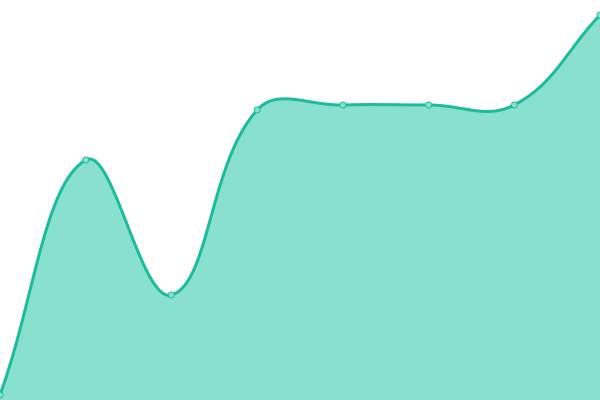

# [📈 Live Status](https://status.schliesser.dev): <!--live status--> **🟥 Complete outage**

This repository contains the open-source uptime monitor and status page for [André Buchmann](https://status.schliesser.dev), powered by [Upptime](https://github.com/upptime/upptime).

With [Upptime](https://upptime.js.org), you can get your own unlimited and free uptime monitor and status page, powered entirely by a GitHub repository. We use [Issues](https://github.com/schliesser/upptime/issues) as incident reports, [Actions](https://github.com/schliesser/upptime/actions) as uptime monitors, and [Pages](https://status.schliesser.dev) for the status page.

<!--start: status pages-->
<!-- This summary is generated by Upptime (https://github.com/upptime/upptime) -->
<!-- Do not edit this manually, your changes will be overwritten -->
<!-- prettier-ignore -->
| URL | Status | History | Response Time | Uptime |
| --- | ------ | ------- | ------------- | ------ |
|  [EC-Balzheim](https://www.ec-balzheim.de) | 🟥 Down | [ec-balzheim.yml](https://github.com/schliesser/upptime/commits/HEAD/history/ec-balzheim.yml) | 

 656ms
     
 | 

<a href="https://status.schliesser.dev/history/ec-balzheim">100.00%</a>
    

|  [Highlanders](https://highlanders.club) | 🟥 Down | [highlanders.yml](https://github.com/schliesser/upptime/commits/HEAD/history/highlanders.yml) | 

 446ms
     
 | 

<a href="https://status.schliesser.dev/history/highlanders">100.00%</a>
    

|  [VertexDezign](https://vertexdezign.net) | 🟥 Down | [vertex-dezign.yml](https://github.com/schliesser/upptime/commits/HEAD/history/vertex-dezign.yml) | 

 36ms
     
 | 

<a href="https://status.schliesser.dev/history/vertex-dezign">100.00%</a>
    

|  Nextcloud | 🟥 Down | [nextcloud.yml](https://github.com/schliesser/upptime/commits/HEAD/history/nextcloud.yml) | 

 277ms
     
 | 

<a href="https://status.schliesser.dev/history/nextcloud">98.98%</a>
    

|  MinIO | 🟥 Down | [min-io.yml](https://github.com/schliesser/upptime/commits/HEAD/history/min-io.yml) | 

 163ms
     
 | 

<a href="https://status.schliesser.dev/history/min-io">100.00%</a>
    

|  [Surfcamp TYPO3 Team Success](https://success.surfcamp.schliesser.dev/) | 🟥 Down | [surfcamp-typo-3-team-success.yml](https://github.com/schliesser/upptime/commits/HEAD/history/surfcamp-typo-3-team-success.yml) | 

 1763ms
     
 | 

<a href="https://status.schliesser.dev/history/surfcamp-typo-3-team-success">100.00%</a>
    

|  Audiobookshelf | 🟥 Down | [audiobookshelf.yml](https://github.com/schliesser/upptime/commits/HEAD/history/audiobookshelf.yml) | 

 38ms
     
 | 

<a href="https://status.schliesser.dev/history/audiobookshelf">100.00%</a>
    

<!--end: status pages-->

[**Visit our status website →**](https://status.schliesser.dev)

## 📄 License

- Powered by: [Upptime](https://github.com/upptime/upptime)
- Code: [MIT](./LICENSE) © [Anand Chowdhary](https://anandchowdhary.com), supported by [Pabio](https://pabio.com)
- Data in the `./history` directory: [Open Database License](https://opendatacommons.org/licenses/odbl/1-0/)
